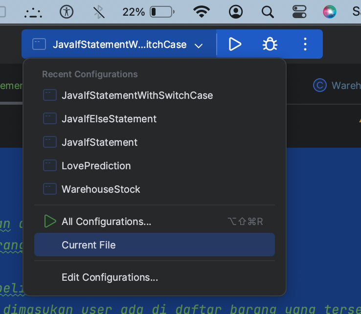

## Clone repo

```shell
> git clone https://github.com/iip-jaelani16/itp-group-2.git
```

### Cara menjalankan program

### manual

```shell
> cd itp-group-2/
> cd src/
> javac JavaMain.java
> java JavaMain
```

### inteliJ IDEA

- dengan menekan tanda ▶️ di pojok kanan atas
- pastikan nama class yang dipilih adalah JavaMain
- 

### resolve conflict

```shell
> git pull origin main
> git add .
> git commit -m "your message"
> git push origin main
```
